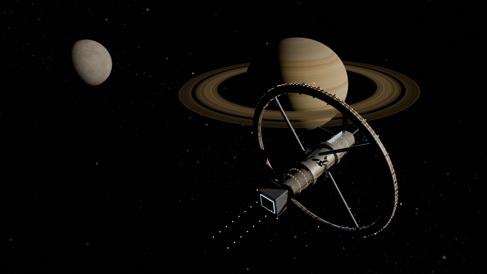
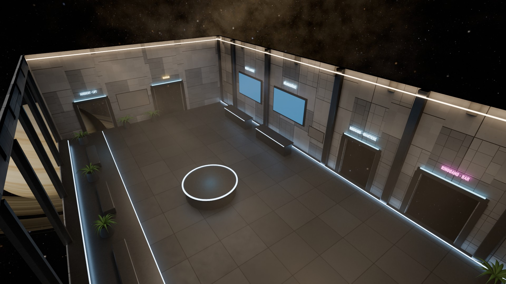
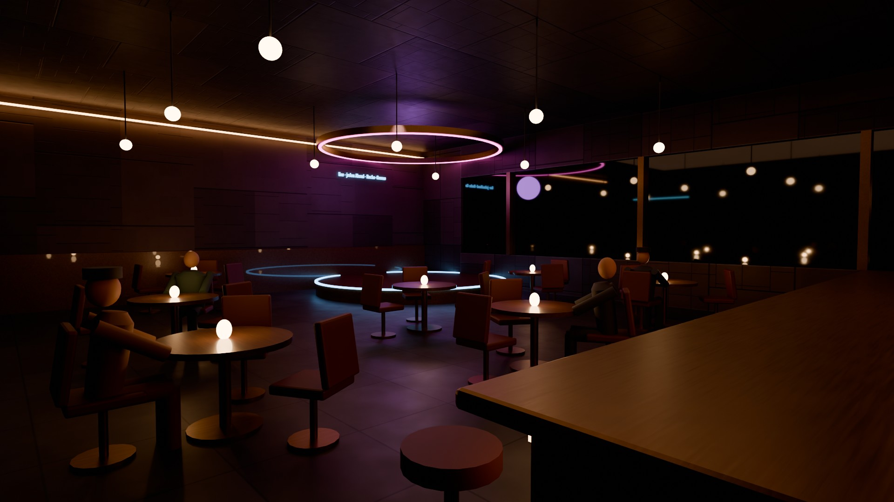
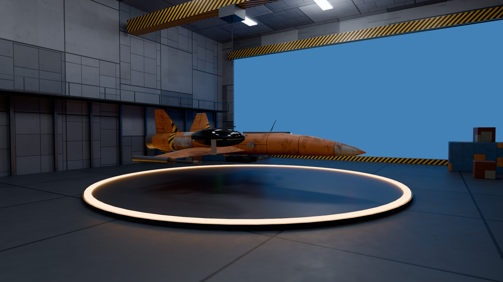
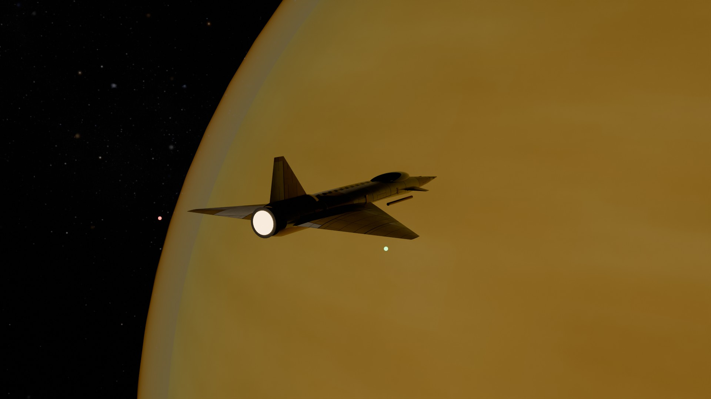

# SpaceWing Saturn

Ein Söldner-Weltraumspiel im Saturnsystem des Jahres 2260. Du startest pleite auf der Hochstation Cassini im Rhea-Orbit, sitzt auf deiner ersten Tour im Kugelturm von Mags Okafors Eisfrachter „Eisvogel“ und bekommst danach eine alte Rostlaube geschenkt: den Kurierjäger SW-2 „Spacewing“. In einer Flugstunde mit Mags lernst du, ihn zu fliegen. Von da an verdienst du Kredits mit Frachtaufträgen, Kopfgeldern und Eskorten, rüstest dein Schiff auf und gerätst in einen Handelskrieg zwischen den Saturnmonden, in dem es um eine Zukunftsprognose im Stil von Asimovs *Foundation* geht.

**Spielen:** https://simon23-12.github.io/SpaceWing/



| Kommandodeck (Übersicht) | Bar „Cassini-Spalt“ |
|---|---|
|  |  |
| **Hangar 7** | **Titan-Orbit** |
|  |  |

## Features

- **Brückenübersicht im Stil von X-Wing Alliance:** ein in Cycles gerendertes Bild des Kommandodecks mit anklickbaren Bereichen (Bar, Hangar, Quartiere, Aussichtsplattform, Söldnerbörse, Werft, Systemkarte).
- **Begehbare Station in der Ich-Perspektive:** Deck 4 der Hochstation Cassini ist ein zusammenhängendes Level. Vom Kommandodeck läuft man durch Schiebetüren in den Ringgang (Bar „Cassini-Spalt“, Kabinen), durch den Hangar-Zugang zu Hangar 7 und fährt mit dem Glaslift hinauf in die Aussichtskuppel. Die Beleuchtung ist in Blender als Global Illumination gebacken, durch die Fenster sieht man den echten Saturn.
- **Menschen statt Puppen:** Alle Stationsbewohner sind geriggte MakeHuman-Figuren mit echten Hauttexturen, Kleidung und Frisuren (CC0) und retargeteten Quaternius-Animationen (CC0): Atmen und Gewichtsverlagerung im Stand, natürliches Sitzen, Gesten beim Reden, Trinken, Gehen. Wer in der Nähe ist, dreht den Kopf zum Spieler. Jede Figur hat einen kleinen Dialogbaum.
- **Fünf Monde als Level:** Rhea, Enceladus, Mimas, Titan und Iapetus, jeder mit eigener Station, eigener Stimmung und eigener Rolle im Handelskrieg. Monde werden im Lauf der Karriere freigeschaltet und per **Hyperraumsprung** erreicht. Dafür braucht das Schiff ein Sprungtriebwerk (Klasse I bis III) aus der Werft. Saturn ist überall sichtbar und im HUD als Fixpunkt markiert.
- **Apartments:** Auf jeder Mondstation kann man eine Wohnung kaufen. Zwischen eigenen Apartments reist man per Transit-Kapsel ohne Flug.
- **Flug mit Verfolgerkamera oder Cockpit:** Das 3D-Cockpit hat Live-Anzeigen für Radar, Ziel und Systeme. Dazu kommen Flughilfe mit Newton-Modus, Nachbrenner, Laser, Raketen mit Zielerfassung, KI-Gegner, Eskorten und Andock-Autopilot.
- **Realistischer Saturn:** abgeplatteter Planet mit Wolkenbändern und Polarhexagon, Ringe mit realer Radialstruktur (C-, B- und A-Ring, Cassini-Teilung, Encke-Lücke, F-Ring), gegenseitige Schatten von Planet und Ringen sowie die Monde Mimas, Enceladus, Tethys, Dione, Rhea, Titan (mit Atmosphäre), Iapetus (zweifarbig, mit Äquatorgrat) und Phoebe.
- **Reisen:** Hyperraumsprung zwischen den Monden, Fusionsbrand innerhalb eines Mondsystems (Mimas ↔ Ringrand, Iapetus ↔ Phoebe).
- **Geld verdienen im Heimatsystem:** Zwischen Hochstation Cassini, dem Bergbauposten Inktomi und dem Frachtdepot L4 gibt es immer Frachtaufträge, ganz ohne Sprungtriebwerk. Unterwegs überfallen manchmal Schakale: Im Rhea-System kann man ihnen mit dem Nachbrenner immer entkommen. Wer kämpft, bekommt Abschussprämien und kann Trümmer einsammeln und als Bergungsschrott verkaufen (Bergungsnetz in der Werkstatt aufrüstbar).
- **Werkstatt in Hangar 7:** Mechanikerin Yara Benedek baut Mods ein, repariert und lackiert gegen Kredits. Eine 3D-Vorschau zeigt jeden Umbau vorher, auch ohne Kredits. Raketenwerfer sind nachrüstbar, Raketen werden einzeln gekauft.
- **Gefechtssimulator** auf dem Kommandodeck: fünf Übungsszenarien mit dem eigenen Schiff, ohne Schaden, mit Bestzeiten.
- **Zielhilfe:** Vorhaltekreis vor jedem Gegner, der grün wird, wenn die Kanonen richtig ausgerichtet sind; Zielerfassung auch für Station und Trümmer.
- **Vertonung:** Funksprüche und Dialoge sind mit lokaler Sprachsynthese (Piper) vertont; im All laufen sie durch einen Funkfilter mit Rauschen und Squelch.
- **Wirtschaft:** zehn Handelswaren, deren Preise auf Story-Ereignisse reagieren (Saturnzoll, Embargo, Krieg), generierte Aufträge, sieben Upgrade-Bereiche pro Schiff, Lackierungen, Schiffskauf und -verkauf.
- **Story:** acht Storymissionen mit drei Enden, siehe [docs/STORY.md](docs/STORY.md).
- **Soundtrack:** eigene Stücke pro Mond, Kampfmusik blendet bei Gefechten ein und wieder aus; dazu prozedurale Lounge-Musik auf der Station und ein improvisierendes Jazztrio in der Bar.
- **Sound:** gesampelte Laser, Explosionen, Treffer, Triebwerk und Türen (CC0), das Jazztrio in der Bar ist prozedural und räumlich, mit Lichtverzögerung aus Kraken-Hafen.

## Technik

| Bereich | Umsetzung |
|---|---|
| Assets | Alle Modelle, Texturen und Renderings entstehen per Python-Skript in **Blender 5** (`blender/`), gesteuert über die lokale MCP-Bridge (`tools/bl.py`). |
| Himmel & Planeten | Prozedurale Shader, als Equirect-Texturen gerendert (Milchstraße 8K, Saturn 4K, Monde mit Höhenkarten). |
| Schiffe & Stationen | Prozedurale Hard-Surface-Modelle mit gebackenen PBR-Texturen (Basisfarbe, AO/Rauheit/Metall, Normalen, Lackmaske). |
| Räume | Cycles-Lightmaps (direktes und indirektes Licht), BVH-Kapselkollision im Browser. |
| Engine | three.js mit zwei Render-Ebenen (Kilometer für den Weltraum, Meter für Schiffe), logarithmischem Tiefenpuffer, Bloom und ACES-Tonemapping. |

```bash
npm install
npm run dev
```

Assets neu erzeugen (Blender muss mit aktivem MCP-Add-on laufen):

```bash
python3 tools/bl.py blender/ships.py spacewing
```

## Steuerung

**Im Kugelturm (Mission 1):** Maus zielen · Linksklick/Leertaste feuern · T Ziel

**Im All:** Maus lenken · W/S Schub · A/D rollen · Shift Nachbrenner · Linksklick/Leertaste Laser · Rechtsklick/F Rakete · T Ziel · C Kamera · L andocken · M Systemkarte · Esc Pause

**Auf der Station:** WASD gehen · Shift laufen · Maus umsehen · E benutzen/sprechen · Tab Deckplan

**Gamepad (Xbox/PlayStation):** linker Stick lenken, rechter Stick rollen, RT Laser, LT Rakete, A Nachbrenner, LB/RB Schub, B Ziel, X Ziel voraus, Y Kamera, Start Karte, Back andocken. Auf der Station: linker Stick gehen, rechter Stick umsehen, A benutzen.

**Joystick (HOTAS):** Knüppel lenken, Drehachse rollen, Schubhebel Schub, Abzug Laser, Taste 2 Rakete, Taste 3 Nachbrenner, Taste 4 Ziel.

**Überall:** F12 Vollbild

## Asset-Lizenzen

Alles ist kostenlos und frei lizenziert. Es gibt keine bezahlten Assets, Abos oder Dienste.

| Was | Quelle | Lizenz |
|---|---|---|
| Körper, Hauttexturen, Augen, Brauen, Wimpern, Haare, Kleidung der NPCs | [MakeHuman System Assets, Skins 01/02](https://static.makehumancommunity.org/assets/assetpacks/index.html) | CC0 1.0 |
| Werkzeug zum Zusammenbauen (Rig „game_engine“) | [MPFB 2](https://extensions.blender.org/add-ons/mpfb/) (Blender-Erweiterung) | Code GPL 3, erzeugte Figuren CC0 |
| Animationen (Idle, Sitzen, Reden, Gehen, Trinken, …) | [Quaternius Universal Animation Library 1 + 2, Standard](https://opengameart.org/content/universal-animation-library-2) | CC0 1.0 |
| Stimmen der Vertonung | [Piper](https://github.com/OHF-Voice/piper1-gpl) (lokal, Werkzeug GPL 3) mit den Stimmen [de_DE-thorsten, thorsten_emotional, kerstin](https://huggingface.co/rhasspy/piper-voices/tree/main/de/de_DE) | Stimmen CC0 1.0 |
| Weitere Stimmen der Vertonung | Piper-Stimme de_DE-mls, trainiert auf [Multilingual LibriSpeech](http://openslr.org/94/) (Pratap et al. 2020) | CC BY 4.0 |
| Soundeffekte (Laser, Explosionen, Treffer, Schilde, Triebwerk, Nachbrenner, Türen) | [Kenney: Sci-Fi Sounds](https://opengameart.org/content/sci-fi-sounds) | CC0 1.0 |
| Musik: Hauptmenü | „Starfield Romance“ von Yoiyami ([OpenGameArt](https://opengameart.org/node/182246)) | CC0 1.0 |
| Musik: Flug Rhea | „Outer Space Loop“ von wipics ([OpenGameArt](https://opengameart.org/content/outer-space-loop)) | CC0 1.0 |
| Musik: Flug Enceladus, Mimas, Iapetus | „Airy“, „Sector“, „Pulse“ aus dem Dark Sci-Fi Audio Pack von SRG774 ([OpenGameArt](https://opengameart.org/content/dark-sci-fi-audio-pack)) | CC0 1.0 |
| Musik: Flug Titan | „Observing the Star“ von yd ([OpenGameArt](https://opengameart.org/node/15560)) | CC0 1.0 |
| Musik: Kämpfe | „Space Battle“ von MintoDog ([OpenGameArt](https://opengameart.org/node/172812)), „Space Synth Wave“ von Alex McCulloch ([OpenGameArt](https://opengameart.org/content/space-synth-wave)) | CC0 1.0 |
| Musik: Aussichtskuppel | „Space Echo“ von Centurion_of_war ([OpenGameArt](https://opengameart.org/node/158292)) | CC0 1.0 |
| Alles andere (Schiffe, Stationen, Räume, Planeten, Himmel, Renderings, Stationsmusik, Bar-Jazz) | eigene Blender-Skripte in `blender/`, prozedurales WebAudio | Projekt |

Die heruntergeladenen Pakete liegen außerhalb des Repos (`../SpaceWing_vendor`). Die Vertonung erzeugt `tools/voices.py` (Zeilen aus `tools/extract_lines.mjs`) nach `public/assets/voice/`. `blender/humans.py` baut aus den MakeHuman-Paketen die GLB-Dateien in `public/assets/npcs/` und retargetet die Animationen auf das MakeHuman-Rig.

**Grenze:** Fotorealistische, frei lizenzierte Menschen in Spielqualität gibt es kostenlos praktisch nicht. Scans und MetaHumans sind entweder lizenzgebunden oder an Dienste und Accounts gekoppelt. MakeHuman ist die realistischste wirklich freie Quelle. Die Figuren sind halbrealistisch, mit echten Fotohaut-Texturen, aber vereinfachten Haaren (Polygonschalen statt Strähnen) und ohne Gesichtsanimation.
